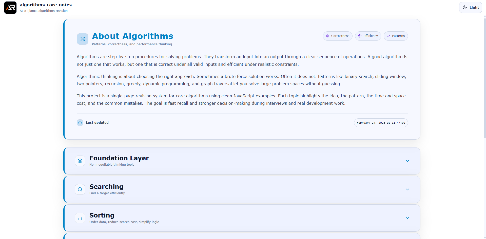

# Algorithms Core Notes

A single-page, at-a-glance revision project for core algorithms and pattern-based problem solving.

This project is designed as a fast reference and structured summary sheet covering essential algorithm concepts without unnecessary depth.  
It focuses on clarity, time and space trade-offs, correctness thinking, and interview-ready patterns using clean JavaScript examples.

---



---

## Purpose

- Quick revision before interviews
- Rapid recall of core algorithm patterns
- Strong mental model of time complexity and space complexity
- Practical, decision-driven reminders for choosing the right approach
- Clear JavaScript implementations that prioritize logic over language tricks

## Coverage

### Foundations (Non-negotiable)

- What is an algorithm
- Input → process → output model
- Correctness vs efficiency
- Complexity recap (time and space)
- Big O refresher (brief but clear)
- Common growth rates intuition
- Recursion mental model and stack cost
- Iterative vs recursive trade-offs
- Amortized analysis (quick intro)
- Lower bounds (conceptual)

### Searching

- Linear search
- Binary search
- Binary search variations (first/last occurrence, lower/upper bound)
- Search on answer concept (intro)
- Two pointer search idea (when applicable)

### Sorting

- Bubble sort
- Selection sort
- Insertion sort
- Merge sort
- Quick sort
- Heap sort (concept + usage)
- Counting sort (when constraints allow)
- Stable vs unstable sorting
- In-place vs extra memory sorting

### Recursion and Backtracking

- Base case thinking
- Subsets generation
- Permutations generation
- Combination patterns
- Backtracking pruning concept
- Divide and conquer concept

### Two Pointers and Sliding Window

- Two pointers basics
- Opposite ends pointers pattern
- Fast and slow pointers (cycle detection idea)
- Sliding window fixed size
- Sliding window variable size
- Common window problems (sum, max, distinct count concept)

### Stack and Queue Patterns

- Stack fundamentals for “undo / nesting”
- Valid parentheses
- Next greater element concept
- Monotonic stack (intro)
- Queue for BFS mindset
- Deque usage patterns (intro)

### Greedy Algorithms

- Greedy choice property (intuition)
- Interval scheduling concept
- Two pointers + greedy combinations
- When greedy fails (quick warning)
- Greedy vs DP boundary (intro)

### Dynamic Programming (DP)

- Overlapping subproblems and optimal substructure
- Memoization (top-down)
- Tabulation (bottom-up)
- 1D DP patterns (Fibonacci style)
- 2D DP intuition (grid style intro)
- 0/1 knapsack concept
- Longest increasing subsequence (conceptual)
- DP state design checklist

### Graph Algorithms (Core)

- Graph representations (adjacency list, matrix)
- BFS
- DFS
- Connected components idea
- Cycle detection concept
- Topological sort concept
- Shortest path intro (BFS vs Dijkstra idea)
- Union-Find usage concept (for cycle/MST idea)

### Complexity Master Section

- Worst case vs average case
- Time vs space trade-offs
- When Big O hides constants
- Practical performance mistakes (nested loops, repeated scanning, heavy sorting)
- Choosing the right approach under constraints

## Tech Stack

- React
- Vite
- styled-components

## Project Type

Single page only  
Section-based navigation  
Searchable and expandable content  
No blog-style content, only structured notes

Each section is modular and collapsible for fast scanning.

## Run Locally

```bash
npm install
npm run dev
```
